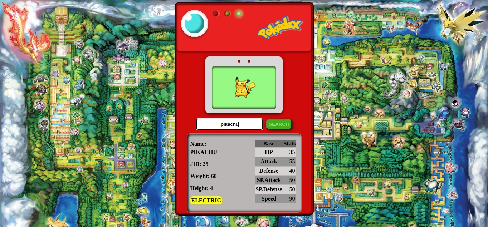

# Pokedex
This is a project that I did from zero using HTML, CSS, JS. I used this pokedex to get a Certification on JavaScript Algorithms and Data Structures on freecode camp(https://www.freecodecamp.org/).

RUN HERE https://th-maia.github.io/Pokedex/

the top left colored lights, stay on are based on the fetch result.
I used speedSyntesis to put a voice, and the classic audio when the user press a key on search input.

